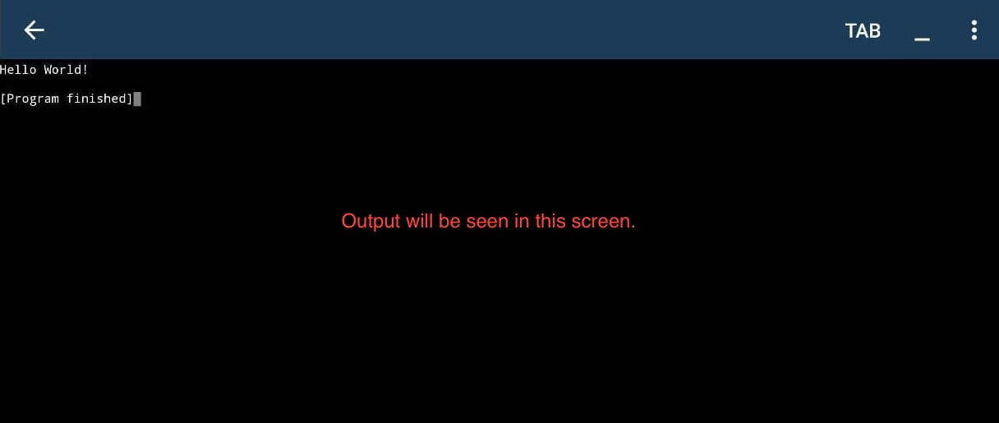
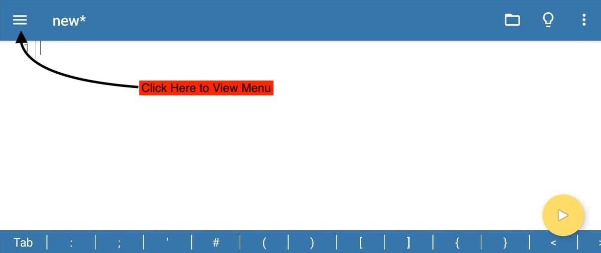
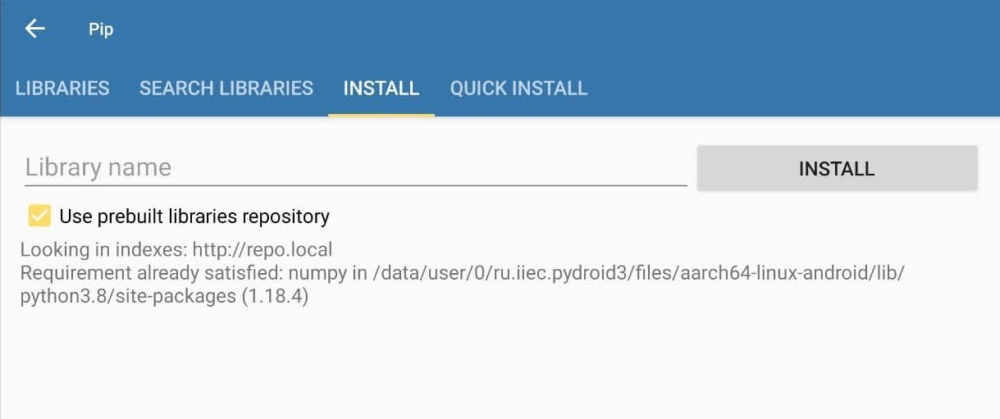
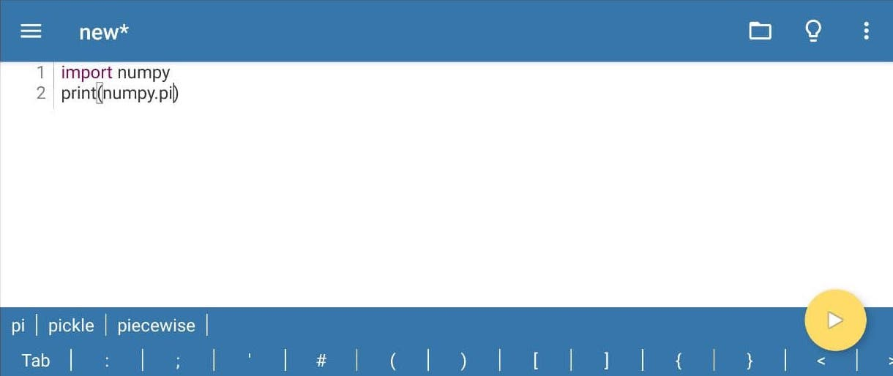
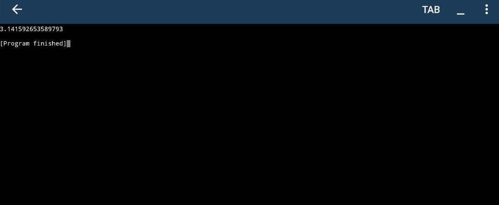

# Quick Start

A warm welcome to the **Python Programming Workshop**. Python is a programming language so before learning anything we have to setup the environment so we can practice the programs. Plebe install python 3 as given below.

## Installation

Programming languages are supposed to be learn on computers. Fortunately now we have apps that can be used to learn python on smartphone. Due to lockdown many faculty members don't have access to the computer. So this programme is designed such that it can be completed on the smartphone. 

#### Android Smartphone

Please install Pydroid 3 IDE(Integrated development environment) from the playstore using the following link

!!! tip "[Install Pydroid 3 IDE](https://play.google.com/store/apps/details?id=ru.iiec.pydroid3)"

After installing the app, we can test it by running a simple program known as `Hello Wrold!`. In this program we have to print the same. In python 3, we have to do the following 

=== "1"

    

=== "2"

    

The strength of any programming language lies inside libraries, python has rich libraries bcs it has been around 30 years. To install libraries you need following app as well.

For example if we want to install the `numpy` library, then we have to do the following. 

=== "1"

    

=== "2"

    

=== "3"

    

=== "4"

    

=== "5"

    

=== "6"

    

#### Computers/Laptops

In order to install python on computer, we can use **anaconda python 3.x** from the bottom of the following page according to your operating system.

!!! tip "[Download Anaconda Python](https://www.anaconda.com/products/individual)"

**Running a simple program** 
In order to run a simple python program and test the installation please follow these steps

1. Open the spider app
2. Type `python("hello world!)`
3. You can see `hello world` printed in output window.

